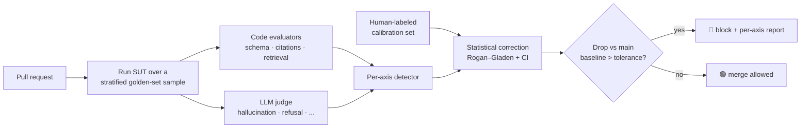

<div align="center">

# 🚦 CIGate

### Gate your CI/CD on the **confidence interval**, not the vibes.

*Eval-gated CI/CD for AI products: block a merge when answer quality statistically
regresses — per failure-mode, with the LLM-judge's bias corrected for, under a cost budget.*

[](.github/workflows/ci.yml)
[](pyproject.toml)
[](LICENSE)
[](#try-it-in-60-seconds-0-offline)

</div>

---

## The problem (a real, expensive one)

Teams shipping LLM and agent products change prompts, retrieval, tools, and model
versions constantly — and those changes have **non-local effects**: fixing one answer
silently breaks ten others. The industry default is *"vibes-based" shipping*, and it
produces **silent quality regressions** that reach production and cost real money.

The system-design case study this implements opens with the canonical disaster: a
well-meaning prompt tweak quietly degraded answer quality on contract questions, an
LLM-judge metric drifted 11 points undetected, and the company lost a **$4M renewal**
before anyone noticed.

## The gap nobody fills

The popular eval tools — Promptfoo, Braintrust, Langfuse, DeepEval — gate on **raw**
LLM-judge scores. But in-domain LLM-judge accuracy is only **~75–88%**, so the judge's
*observed* pass rate is biased. Gating on it means you either:

- **over-block** (false alarms → developers route around the gate), or
- **under-block** (real regressions still ship).

**CIGate gates on the _bias-corrected_ pass rate's _confidence-interval lower bound_,
per failure-mode axis.** That's the part the case study makes its centerpiece and the
mainstream tools skip. (The "CI" pun is the whole thesis: gate your **C**ontinuous
**I**ntegration on a **C**onfidence **I**nterval.)

## What it looks like on a PR

A one-line prompt change ships `answer_v2` ("be helpful and complete, citations
optional"). CIGate runs on the PR and posts this — then **blocks the merge**:

> ### ❌ CIGate: merge blocked — 2 axis regression(s)
> `prompt=answer_v2` · `judge=mock` · `sample=60/300` · `cost=$0.00`
>
> | | Axis | Raw judge | Corrected | 95% CI | Baseline | Δ | Verdict |
> |---|---|---|---|---|---|---|---|
> | 🔴 | `hallucination` | 45.0% | 37.0% | [11.1%, 59.0%] | 98.9% | −61.9 pp | REGRESSED |
> | 🟢 | `retrieval_miss` | 85.0% | 91.1% | [69.8%, 100%] | 100% | −8.9 pp | ok |
> | 🔴 | `citation_error` | 61.7% | 65.5% | [47.6%, 82.3%] | 100% | −34.5 pp | REGRESSED |
> | 🟢 | `refusal` | 71.7% | 76.5% | [55.9%, 91.9%] | 93.2% | −16.7 pp | ok |
> | 🟢 | `format_violation` | 100% | 95.0% | [88.2%, 100%] | 98.9% | −3.9 pp | ok |

The regression is **isolated to the two axes the change actually hurt** — a single
composite score would have hidden it. A clean change goes green and merges. Full samples:
[`docs/samples/`](docs/samples/).

## How it works



1. **Sample** the golden set, stratified so every failure-mode axis is represented (cost
   control — a per-PR run touches a fraction, nightly runs the full set).
2. **Score** each case two ways: cheap deterministic **code checks** (citations, schema,
   retrieval) and an **LLM-as-judge** for subjective axes.
3. **Correct** the judge's bias: using its sensitivity/specificity measured on a
   human-labeled calibration set, recover the true pass rate with a confidence interval.
   Deterministic axes skip correction (they're unbiased) and use an exact binomial interval.
4. **Gate** per axis with a one-sided **two-sample drop test** vs the committed `main`
   baseline (Bonferroni-corrected across axes): block only when we're confident the drop
   exceeds tolerance. Identical builds never false-block, regardless of CI width.

## The statistical core (the part that matters)

Raw judge pass rate `p_obs` is biased. With judge sensitivity (TPR) and specificity
(TNR) measured on a labeled calibration set, the **Rogan–Gladen** estimator recovers the
true rate:

```
            p_obs + TNR − 1
θ̂  =  clip( ───────────────── , 0, 1 )
             TPR + TNR − 1
```

The confidence interval uses the **adjusted-Wald delta method** (Lee, Zeng et al.,
[arXiv:2511.21140](https://arxiv.org/abs/2511.21140)), combining all three uncertainty
sources — evaluated-sample, sensitivity, and specificity — with correct ~95% coverage
even on small calibration sets. We cross-check it against the
[`judgy`](https://github.com/ai-evals-course/judgy) library in the test suite, and the
implementation reproduces the paper's worked example exactly. See
[`docs/METHODOLOGY.md`](docs/METHODOLOGY.md).

If the judge is no better than chance (`TPR + TNR ≤ 1`) or the CI is too wide, CIGate
**refuses to gate** that axis rather than guess.

## Try it in 60 seconds ($0, offline)

Everything runs in a deterministic **mock mode** — no API key, no spend — which is also
what powers the test suite and the demo CI.

```bash
git clone https://github.com/awesome-pro/cigate && cd cigate
pip install -e ".[dev]"

cigate baseline --promote                 # establish a 'good' baseline (full run)
BUILD_FLAVOR=regressed cigate gate        # → blocks: hallucination + citation_error red
BUILD_FLAVOR=good      cigate gate        # → passes: all axes within tolerance
pytest -q                                 # 26 tests, all green, $0
```

Want the real thing? Set `ANTHROPIC_API_KEY` and install the extra — the *same* pipeline
now uses Claude as generator and judge:

```bash
pip install -e ".[real]"
export ANTHROPIC_API_KEY=sk-...
cigate gate                               # real Claude answers, scored + corrected
```

## Two datasets: synthetic + real

- **`synthetic_contract`** — a generated contract/insurance support set (300 cases, 50
  policy docs). Fully controlled; powers the deterministic demo and tests.
- **`cuad_real`** — built from [**CUAD**](https://www.atticusprojectai.org/cuad) (real
  commercial contracts with expert clause annotations, CC BY 4.0). Its headline use: the
  LLM judge is **calibrated against real human expert labels**, so the correction's
  confusion matrix is *measured from real bias*, not assumed. (`evalconfig_cuad.yaml`)

## Use it on your own product

CIGate is product-agnostic. Point `evalconfig.yaml` at any callable
`(question) -> SUTOutput` and bring your own golden set:

```yaml
sut: "yourapp.bot:answer"          # module:callable
goldenset: "goldensets/yours.yaml"
axes: [hallucination, citation_error, ...]
gate: { tolerance: 0.02, confidence_level: 0.95 }
```

Then drop the GitHub Action into your pipeline (see [`.github/`](.github/)):

```yaml
- uses: awesome-pro/cigate/.github/actions/eval-gate@v0.1
  with:
    config: evalconfig.yaml
    anthropic-api-key: ${{ secrets.ANTHROPIC_API_KEY }}   # omit -> $0 mock mode
```

## What's in here

| Path | What |
|---|---|
| `src/cigate/stats.py` | Rogan–Gladen + adjusted-Wald CI — the correction core |
| `src/cigate/gate.py` | per-axis two-sample drop test vs baseline |
| `src/cigate/{runner,evaluators,calibrate}.py` | eval execution, code+judge scoring, drift |
| `src/refbot/` | the demo RAG bot (BM25 + Claude/mock generator) |
| `.github/` | composite Action + PR / nightly workflows |
| `dashboard/app.py` | Streamlit dashboard (per-axis, calibration, live gate) |
| `docs/` | architecture, methodology, auditor pack, article, demo script |

## More

- 🏗 [Architecture](docs/ARCHITECTURE.md) · 📐 [Methodology](docs/METHODOLOGY.md) ·
  🧾 [Auditor pack sample](docs/samples/auditor_pack.md) · 🎬 [Demo script](docs/DEMO_SCRIPT.md)
- Built from the "Eval-Gated CI/CD" system-design case study. Grounded in the evals work
  of Hamel Husain, Shreya Shankar, and Eugene Yan.

## License

MIT. CUAD data under CC BY 4.0 — see `data/cuad/ATTRIBUTION.md`.
