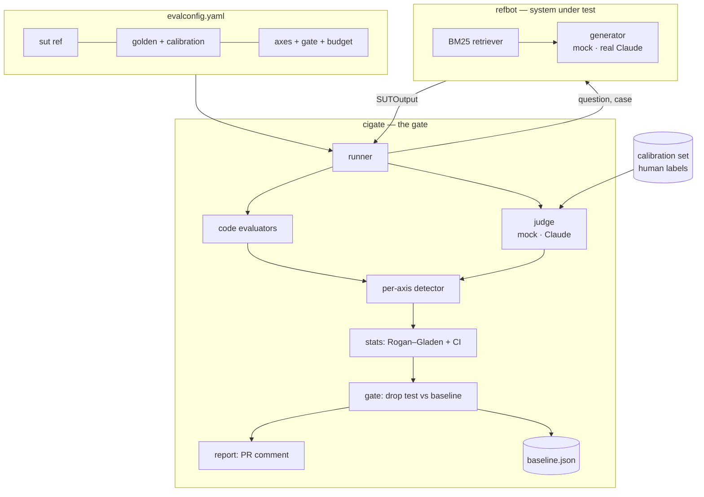

# Architecture

CIGate is two cleanly separated packages tied together by `evalconfig.yaml`:

- **`cigate`** — the reusable, product-agnostic gate.
- **`refbot`** — the demo system-under-test (a contract/insurance RAG bot). Swap it for
  any product by changing one line in the config.

## The boundary contract

CIGate never imports the product. It speaks four dataclasses (`cigate/types.py`):

| Type | Role |
|---|---|
| `Case` | one golden example: question, gold docs, `in_corpus`, per-axis `truth_labels` |
| `SUTOutput` | product output: `text`, `citations`, `retrieved_ids`, `meta` |
| `AxisEstimate` | corrected pass rate + CI + SE for one axis |
| `AxisGateResult` | the per-axis block/pass decision vs baseline |

The system-under-test is any `"module:callable"` resolved at runtime
(`cigate/sut.py`). The reference value is `refbot.pipeline:rag_answer`.

## The "detector" abstraction

Every axis is scored by a **detector** whose bias is then measured and corrected
uniformly:

| Axis | Evaluator | Detector |
|---|---|---|
| `hallucination` | judge | LLM judge |
| `refusal` | judge | LLM judge |
| `retrieval_miss` | both | code **AND** judge |
| `citation_error` | both | code **AND** judge |
| `format_violation` | code | code only |

- **Judge / both** axes carry bias → Rogan–Gladen correction with a confidence interval.
- **Code-only** axes are unbiased → exact binomial (Agresti–Coull) interval, no correction.

## Mock vs real — one flip

`CIGATE_MOCK=1` or a missing `ANTHROPIC_API_KEY` puts the whole system in deterministic
mock mode ($0, offline, powers tests + CI). A present key flips generator **and** judge
to Claude with no other change.

- **Mock generator** (`refbot/generator/mock.py`) is a pure function of
  `(case, hits, flavor, seed)`. It records the *true* per-axis outcome of its own output
  in `SUTOutput.meta["truth"]`.
- **Mock judge** (`cigate/evaluators/judge.py`) corrupts that truth through a configured
  per-axis confusion matrix `(sensitivity, specificity)`, seeded per (case, axis). Over
  the dataset its empirical TPR/TNR match the configuration — so the correction layer has
  *real, known* bias to recover (asserted in tests).

This is why the demo's red/green CI flip is perfectly reproducible with zero API calls.

## Baseline & CI flow

- The baseline is a committed `.cigate/baseline.json` on `main` (durable, diffable,
  versioned quality history). PR runs read it via `git show origin/main:...`.
- `nightly.yml` re-promotes it from a full run; `eval-gate.yml` runs per PR, posts a
  sticky comment, and `exit 1`s on regression (the red required check). Commenting and
  the block decision live in the *workflow*, not the action — for composability and fork
  safety (forked PRs fall back to mock + best-effort comment).

## Cost control

- Per-PR runs evaluate a **stratified sample** (default 20%, every axis represented).
- A hard per-run budget ceiling (`cigate/cost.py`) aborts before overspend.
- Token pricing is modeled per Claude tier; mock mode is always $0.

See [`METHODOLOGY.md`](METHODOLOGY.md) for the statistics.
